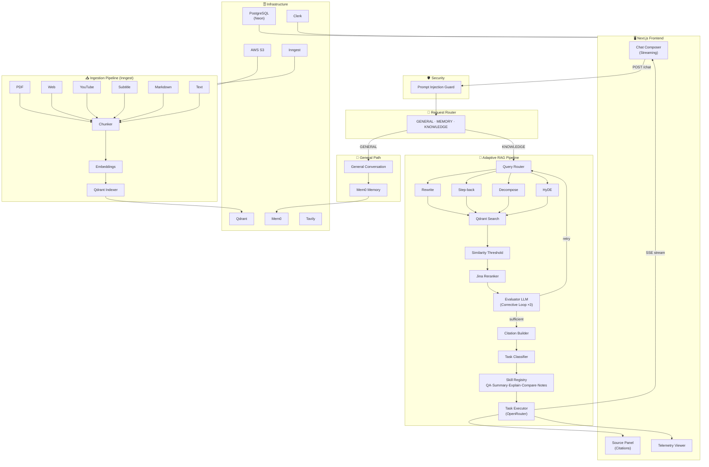

# Groundwork

> **A scalable, explainable, multi-source RAG (Retrieval-Augmented Generation) platform with adaptive query routing, corrective retrieval, and verifiable citation-backed responses.**

Groundwork is a full-stack AI research workspace that lets you ingest documents from multiple sources and have deep, grounded conversations with your knowledge base. Every response is backed by traceable citations that link directly to the source chunk that produced it.

---

## ✨ Key Features

### 📥 Multi-Source Ingestion (Async via Inngest)
| Source | Parser |
|---|---|
| PDF files | `pdf-parse` |
| Web pages | Custom web scraper |
| YouTube videos | `youtube-caption-extractor` |
| Subtitles (VTT / SRT) | Custom subtitle parser |
| Markdown files | Custom markdown parser |
| Plain text files | Text parser |

All ingestion is handled asynchronously through an event-driven pipeline powered by **Inngest** — parsing, chunking, embedding, and vector indexing happen in the background without blocking the API.

---

### 🧠 Adaptive RAG Pipeline

The core of Groundwork is a multi-stage retrieval pipeline that goes far beyond a simple vector search:

```
User Query
    │
    ▼
[Request Router]  ──── GENERAL ──▶ General Conversation (Mem0 memory)
    │              ──── MEMORY  ──▶ Memory Retrieval (Mem0)
    │              ──── KNOWLEDGE ─▶ Adaptive RAG Pipeline
    ▼
[Prompt Injection Guard]
    │
    ▼
[Query Router]  →  decides which expansions to run
    │
    ├─ Query Rewrite      (cleaner semantic intent)
    ├─ Step-back Prompt   (abstracts to a higher-level principle)
    ├─ Query Decomposition (splits complex queries into sub-queries)
    └─ HyDE               (generates a hypothetical answer to embed)
    │
    ▼ (all representations retrieved in parallel)
[Qdrant Vector Search] × N queries
    │
[Similarity Thresholding]  (min score floor on chunks)
    │
[Jina Cross-Encoder Reranking]  (semantic relevance, not just cosine similarity)
    │
[Evaluator LLM]  ──── Sufficient? ──▶ Continue
    │              ──── Insufficient? ─▶ Generate fallback query → retry (max 3 attempts)
    │
[Citation Builder]  (maps chunks to [C1], [C2]... references)
    │
[Task Classifier]  →  QA · Summary · Explain · Notes
    │
[Skill Registry]  (each skill has a specialized system prompt)
    │
[Task Executor]  →  Vercel AI SDK + OpenRouter  →  Streaming SSE to client
```

---

### 🖥️ Frontend
- **Streaming chat** powered by Vercel AI SDK `useChat`
- **Source Panel** with deep-linked citations (`[C1]`, `[C2]` → source chunk)
- **Retrieval Telemetry Viewer** — see which queries ran, what was retrieved, and how it was reranked
- **Streaming Markdown rendering** via `streamdown`
- **Conversation history** persisted to PostgreSQL

---

## 🏗️ Architecture Diagram



---

## 🛠️ Tech Stack

### Backend
| Category | Technology |
|---|---|
| Runtime | Node.js, TypeScript |
| Framework | Express 5 |
| ORM | Sequelize + `sequelize-typescript` |
| Database | PostgreSQL (Neon) |
| Vector DB | Qdrant Cloud |
| Queue / Events | Inngest |
| LLM Orchestration | Vercel AI SDK |
| LLM Provider | OpenRouter (model-agnostic) |
| Reranker | Jina AI Cross-Encoder |
| Memory | Mem0 |
| Web Search | Tavily |
| File Storage | AWS S3 |
| Auth | Clerk (`@clerk/express`) |
| Validation | Zod |
| Logging | Winston |
| Testing | Vitest |

### Frontend
| Category | Technology |
|---|---|
| Framework | Next.js 16 (App Router) |
| UI Library | React 19 |
| Styling | Tailwind CSS v4 |
| Components | shadcn/ui + Radix UI |
| AI Streaming | Vercel AI SDK (`@ai-sdk/react`) |
| Data Fetching | TanStack Query |
| Markdown | `streamdown` |
| Auth | Clerk (`@clerk/nextjs`) |
| PDF Viewer | `react-pdf` |

---

## 🚀 Getting Started

### Prerequisites
- Node.js 20+
- A [Qdrant Cloud](https://cloud.qdrant.io/) account and cluster
- A [Neon](https://neon.tech/) PostgreSQL database
- An [OpenRouter](https://openrouter.ai/) API key
- A [Clerk](https://clerk.com/) application
- A [Jina AI](https://jina.ai/) API key (for reranking)
- An [Inngest](https://www.inngest.com/) account (or run the dev server locally)
- A [Mem0](https://mem0.ai/) API key (for memory)

---

### 1. Clone the repository

```bash
git clone <your-repo-url>
cd "Adaptive RAG"
```

---

### 2. Backend Setup

```bash
cd backend
npm install
```

Create a `.env` file in `backend/`:

```env
# Server
PORT=8000
NODE_ENV=development

# Database (Neon PostgreSQL)
DATABASE_URL=your_neon_connection_string

# Clerk Auth
CLERK_SECRET_KEY=sk_test_...
CLERK_PUBLISHABLE_KEY=pk_test_...

# OpenRouter (LLM Provider)
OPENROUTER_API_KEY=your_openrouter_api_key
OPENROUTER_MODEL=openai/gpt-4o-mini
OPENROUTER_EXPANSION_MODEL=openai/gpt-4o-mini
OPENROUTER_ROUTER_MODEL=openai/gpt-4o-mini
OPENROUTER_GENERAL_CHAT_MODEL=openai/gpt-4o-mini
OPENROUTER_REQUEST_ROUTER_MODEL=openai/gpt-4o-mini

# Qdrant
QDRANT_URL=https://your-cluster.qdrant.io
QDRANT_API_KEY=your_qdrant_api_key
QDRANT_COLLECTION_NAME=groundwork_chunks

# Jina AI (Reranker)
JINA_API_KEY=your_jina_api_key

# Inngest
INNGEST_EVENT_KEY=your_inngest_event_key
INNGEST_SIGNING_KEY=your_inngest_signing_key

# AWS S3
AWS_ACCESS_KEY_ID=your_aws_access_key
AWS_SECRET_ACCESS_KEY=your_aws_secret_key
AWS_REGION=us-east-1
AWS_S3_BUCKET_NAME=your_bucket_name

# Mem0
MEM0_API_KEY=your_mem0_api_key


# RAG Config
RAG_RETRIEVAL_CANDIDATES=20
RAG_CONTEXT_TOP_K=8
RAG_MIN_SIMILARITY_SCORE=0.5
RAG_RERANKING_ENABLED=true
```

Run database migrations:

```bash
npm run migrate
```

Start the backend dev server:

```bash
npm run dev
```

The API will be available at `http://localhost:8000`.

---

### 3. Frontend Setup

```bash
cd client
npm install
```

Create a `.env.local` file in `client/`:

```env
NEXT_PUBLIC_CLERK_PUBLISHABLE_KEY=pk_test_...
CLERK_SECRET_KEY=sk_test_...
NEXT_PUBLIC_API_URL=http://localhost:8000
```

Start the frontend dev server:

```bash
npm run dev
```

Open [http://localhost:3000](http://localhost:3000).

---

### 4. Inngest Dev Server (for local background jobs)

In a separate terminal:

```bash
npx inngest-cli@latest dev
```

This will start the Inngest dev server and pick up your ingestion and memory workers automatically.

---

## 🏛️ Architecture Principles

- **Strict Layered Architecture**: Routes → Controllers → Services → DAOs. Controllers never touch the database directly.
- **Workspace Isolation**: Every Qdrant search and database query is scoped by `workspaceId`.
- **Untrusted Data Isolation**: Retrieved chunks and scraped content are never allowed to override system prompts.
- **Traceable Citations**: `[C1]`, `[C2]` references in every response are validated against actually retrieved chunks before persisting — hallucinated citations are impossible by design.
- **Provider-Agnostic LLM Layer**: Switching LLM providers requires changing a single environment variable. No prompt re-engineering needed.
- **Zod Validation**: All external API inputs and structured LLM outputs are validated with Zod schemas.

---

## 📄 License

MIT

---

## 🙋 Author

Built by **Ravikiran Jangir** as a portfolio project exploring production-oriented RAG system design.

Feel free to open an issue or reach out with architectural feedback!
